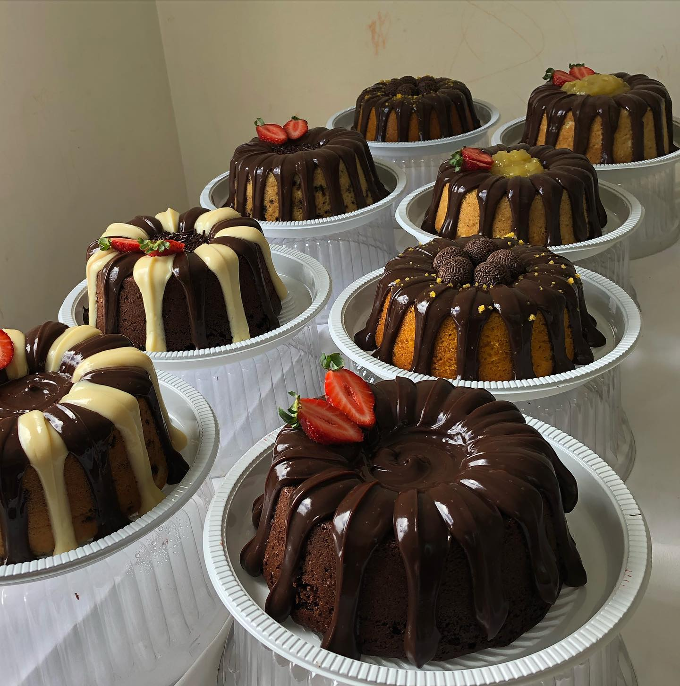

# Atividade 0 - IA01008 - UFPA - Prof. Claudomiro Sales
**Aluna:** Andrelly Richelly 
**Matrícula:** 202692540024

## Tema Escolhido: STARTUP / APP - Doce Anndy Chocolates

Este repositório contém a apresentação em Jupyter Notebook da minha startup real @doce_anndy, conforme solicitado na Atividade 0.

### O que tem neste repositório:
- `Atividade_0_FINAL_COMPLETA_andrelly.ipynb` - Notebook completo com índice, apresentação da startup e tratamento do dataset
- `bolos_doce_anndy.jpg` - Foto dos produtos da confeitaria
- `README.md` - Este arquivo

### Sobre o projeto:
- **O que é:** Startup de chocolates artesanais em Belém
- **Problema Real:** Prever quais sabores produzir mais em datas comemorativas
- **Solução com IA:** Classificador binário Perceptron para prever intenção de compra

### Como executar no Colab:

É só clicar no botão azul acima que abre seu notebook direto no Colab!
